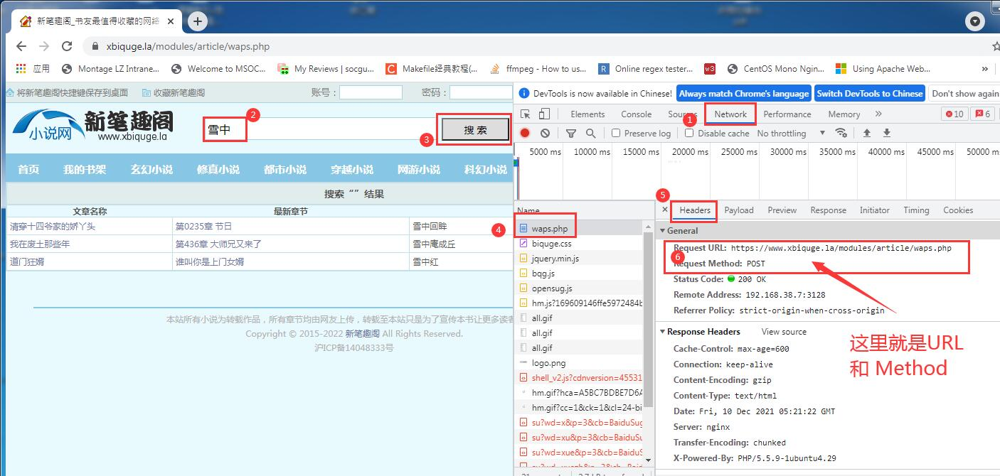
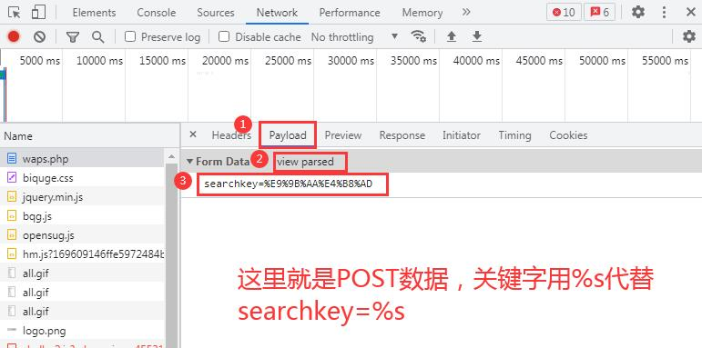
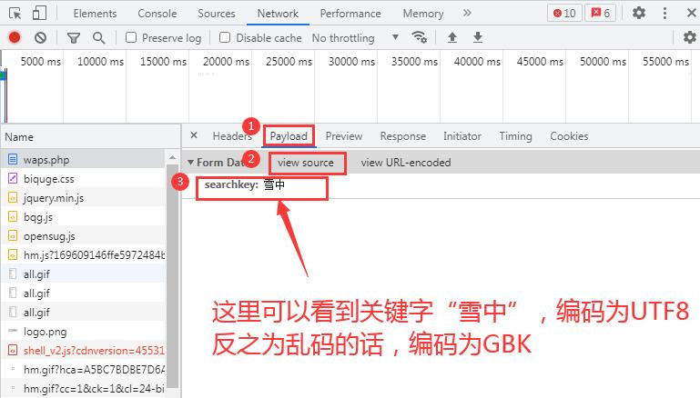
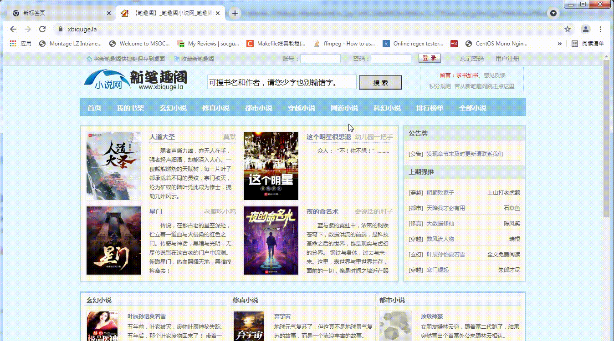
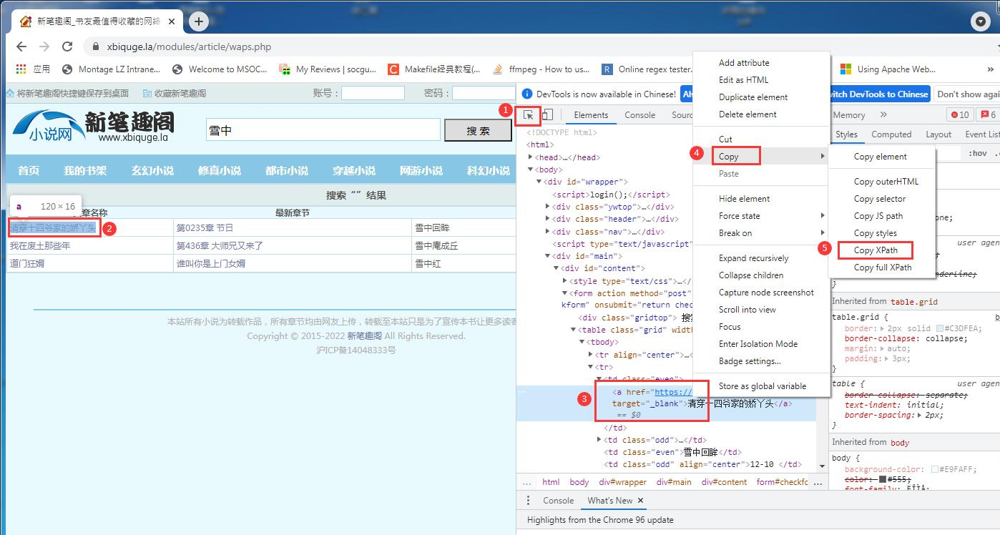
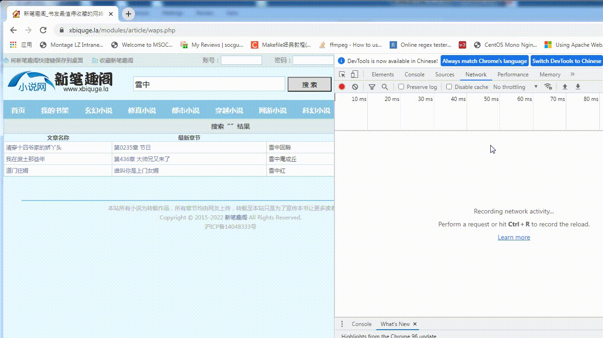

# Reader\_v1.10.1版本书源配置文档

## 1. 书源网站要求
> 目前版本的Reader支持大部分书源网站的规则配置。但是有如下要求：  
1. 网站必须有搜索小说的功能
2. 书源网站没有太强大的防爬机制


## 2. 基本信息配置
1. **标题**：书源名，随意自定义，不要重复
2. **HOST**：书源Host地址
> 如某网站的首页为：https://www.xbiquge.la/?hpprotid=2a8031d1  
> 则此网站的HOST为：https://www.xbiquge.la  
3. **搜索URL**：搜索书籍的地址，关键字段用 %s 代替，支持GET/POST
4. **参数**：POST的数据，关键字段用 %s 代替
5. **关键字编码格式**：AUTO/UTF-8/GBK
> AUTO：根据http header编码方式自动识别。  
> UTF-8：utf-8编码。  
> GBK：gbk编码。  
> 部分网站使用AUTO模式会有问题。  
6. 如果你不清楚如何设置搜索参数，请参考下文  **搜索参数配置（详解）**


## 3. 搜索页解析配置
1. **书籍名称 xpath**：用于在搜索结果页面，解析书籍名称的xpath
2. **书籍主页 xpath**：用于在搜索结果页面，解析书籍主页(章节列表页)URL的xpath
3. **作者名称 xpath**：用于在搜索结果页面，解析作者名称的xpath，可以不填


## 4. 书籍主页解析配置
> 这里的书籍主页是指，非章节列表页。  
> 若搜索后点击进入书籍主页，此页面没有章节列表，则需要配置该项，在下拉框选择```Enable```，如：https://www.yushubo.com/  
> 反之进入的书籍主页里面有全部的章节列表，则不需要配置该项，在下拉框选择```Disable```，如：https://www.xbiquge.la/  
1. **章节列表页xpath**：用于获取章节列表页链接的xpath。


## 5. 书籍章节列表页解析
1. **章节标题 xpath**：解析小说主页章节名称的xpath
2. **章节URL xpath**：解析每章节地址的xpath
3. **章节列表分页**：如果章节列表是分页显示的则需要配置，选择```Enable```，反之选择```Disable```。
4. **下一页xpath**：用于解析章节列表下一页链接的xpath
5. **下一页关键字xpath**：用于解析下一页按钮文本的xpath
6. **下一页关键字**：下一页关键字文本
> Reader程序里面会对&quot;xpath解析到的文本&quot;和&quot;设置进去的文本&quot;进行对比。如果两者文本相同则认为还有下一页，反之则认为已经获取到了全部章节列表。  


## 6. 书籍章节内容页解析
1. **章节内容 xpath**：解析每章小说主文本的xpath
2. **章节内容分页**： 如果章节文本是分页显示的则需要配置，选择```Enable```，反之选择```Disable```。
3. **下一页xpath**：用于解析章节文本下一页链接的xpath
4. **下一页关键字xpath**：用于解析下一页按钮文本的xpath
5. **下一页关键字**：下一页关键字文本
> Reader程序里面会对&quot;xpath解析到的文本&quot;和&quot;设置进去的文本&quot;进行对比。如果两者文本相同则认为还有下一页，反之则认为已经获取到了本章节全部文本内容。  
6. **文本过滤**：去除章节内容中的广告和无用字符串
> ```无```：不需要过滤文本  
> ```关键字```：匹配固定文本并去除  
> ```正则表达式```：用于文本不固定场景，去除匹配正则表达式的文本  
> 由于在线小说会进行本地缓存，修改后只对未下载章节文本生效。或者请重新搜索并打开软件。  


## 7. 搜索参数配置（详解）
> GET模式只需要配置&quot;搜索URL&quot;。  
> POST模式则需要同时配置POST参数。  
> 你可以用chrome浏览器来获取这些数据。步骤如下：  
1. 打开浏览器进入网站
2. 按F12进入chrome调试模式，选择&quot;Network&quot;
3. 在网站上面输入书籍名称点击搜索
4. 在chrome调试窗口选择第一个，就可获取&quot;URL&quot;和```POST``` / ```GET```。如下图：



5. 在chrome调试窗口再次点击Payload > view source，就可以获取POST参数了

> 比如：```searchkey=%E9%9B%AA%E4%B8%AD```，则Reader里面配置的post参数为：```searchkey=%s```。如下图：  



6. 在chrome调试窗口再次点击Payload > view parsed，就可以判断搜索关键字编码格式了
> 如果关键字显示正常，则为UTF8编码  
> 反之如果关键字显示乱码，则为GBK编码，如下图：  



7. 请参考下面的gif图片




## 8. Xpath 配置说明（详解）
> 这里讲解如何使用chrome浏览器获取xpath  
> xpath语法知识这里不做说明  
1. 打开浏览器进入网站
2. 按F12进入chrome调试模式
3. 点击调试模式里面的选择  ，然后在页面上面点击你需要获取xpath的地方
4. 在调试模式里面右击html的标签，选择copy > copy xpath。这时xpath已经拷贝



5. 在任意文本编辑器上面粘贴已经拷贝xpath。
6. 然后选择下一个html标签，重复步骤3至步骤5。
7. 对比修改xpath。参考如下三个样例。

**样例一**：  
比如在搜索页上面选择搜索结果第一行小说和第二行小说获得的xpath分别如下：  
```//*[@id="checkform"]/table/tr[1]/td[1]/a```  
```//*[@id="checkform"]/table/tr[2]/td[2]/a```  
则Reader里面配置的xpath为：  
```//*[@id="checkform"]/table/tr/td[1]/a```  
上面的```[1]```表示第一行，```[2]```表示第二行。这里去掉了```[1]```和```[2]```，表示需要获取所有行。  

**样例二**：  
比如在搜索页上面选择搜索结果第一行小说和第二行小说获得的xpath分别如下：  
```//*[@id="checkform"]/table/tr[2]/td[1]/a```  
```//*[@id="checkform"]/table/tr[3]/td[1]/a```  
则Reader里面配置的xpath为：  
```//*[@id="checkform"]/table/tr[position()>1]/td[1]/a```  
上面的```[position()>1]```表示从第二行开始才是你真正需要的数据。  

**样例三**：  
值得注意的是，使用chrome获取的xpath不一定都是完全正确的，比如：  
```//*[@id="checkform"]/table/tbody/tr[2]/td[1]/a```  
```//*[@id="checkform"]/table/tbody/tr[3]/td[1]/a```  
则Reader里面配置的xpath为：  
```//*[@id="checkform"]/table/tr[position()>1]/td[1]/a```  
这里需要去掉tbody

**注意事项：```@href``` 的使用**：  
获取网页上面的显示的文本：```//*[@id="checkform"]/table/tr/td[1]/a```  
获取该本文对应的链接地址：```//*[@id="checkform"]/table/tr/td[1]/a/@href```  
取链接地址需要加上  ```/@href```  
以下配置项为需要取链接地址：  
> 书籍主页xpath  
> 章节列表页xpath  
> 章节URL xpath  
> 下一页xpath  
  

8. 下面gif动图展示下上面的步骤3至步骤5




## 9. 书源配置后的调试
> 书源配置无法避免可能会出现一些与预期不一样的问题。
> 这时我们可能需要借助一些工具来检查书源配置是否正确。  
1. 使用Reader的debug版本程序。
> 作者有释放debug版本软件。  
2. 观察程序运行日志
> 在Reader.exe同级目录下面会生成如：Reader\_xxxx\_xx\_xx.log这样的文件。  
> 用文本编辑器打开即可查看。  
> 可以看出http request请求是否成功，请求哪一个URL地址时出现了问题。  
3. 观察dump.html
> 如果URL请求成功，但是xpath解析失败，会在Reader.exe同级目录下面会生成dump.html文件。  
> 使用文本编辑器打开该文件，可以判断出是xpath配置的不对，还是获取的html数据不对。  


## 10. 书籍配置样例
> 下载 [bs.json](../bs.json) 文件, (点击raw，然后右键保存即可。如果raw打不开，可以手动拷贝文件内容，保存到本地文件)  
> 然后进入书源配置页面，选择"导入"即可使用  
> 点击“自动配置”按钮会，会自动下载 bs.json 并解析。由于github网络原因，有时会无法成功下载，为正常现象。  


## 11. 免责声明
> Reader为我个人开发的一款绿色、开源、免费的阅读器软件，主要用于小说阅读，为广大网络文学爱好者提供一种方便、快捷舒适的阅读体验。同时为广大软件开发者、爱好者提供学习参考。所有版权归作者所有。  
> 对于在线书源功能，获取的内容均为第三方网络文学网站公开信息，不会对该网站进行大量和快速请求（每个章节URL只会请求一次，然后缓存到本地文件，只会缓存当前阅读相邻章节）、不会进行暴力破解、无病毒入侵。  
> 当您搜索一本书的时，阅读器会将该书的书名以关键词的形式提交到各个第三方网络文学网站。各第三方网站返回的内容与阅读器无关，阅读器对其概不负责，亦不承担任何法律责任。任何通过使用阅读器链接到的第三方网页均系他人制作或提供，您可能从第三方网页上获得其他服务，阅读器对其合法性概不负责，亦不承担任何法律责任。第三方搜索引擎结果根据您提交的书名自动搜索获得并提供试读，不代表本阅读器赞成或被搜索链接到的第三方网页上的内容或立场。您应该对使用搜索引擎的结果自行承担风险。  
> 不做任何形式的保证：不保证第三方搜索引擎的搜索结果满足您的要求，不保证搜索服务不中断，不保证搜索结果的安全性、正确性、及时性、合法性。 因网络状况、通讯线路、第三方网站等任何原因而导致您不能正常使用阅读，阅读器不承担任何法律责任。阅读器尊重并保护所有使用阅读器用户的个人隐私权。  
> 所有小说书籍版权归小说作者所有。  
> 所有书源归第三方书源网站所有。  
> 建议和鼓励大家直接至第三方书源网站直接阅读小说。  
> 您在使用该软件进行阅读时，代表您已经接受上述协议。  
